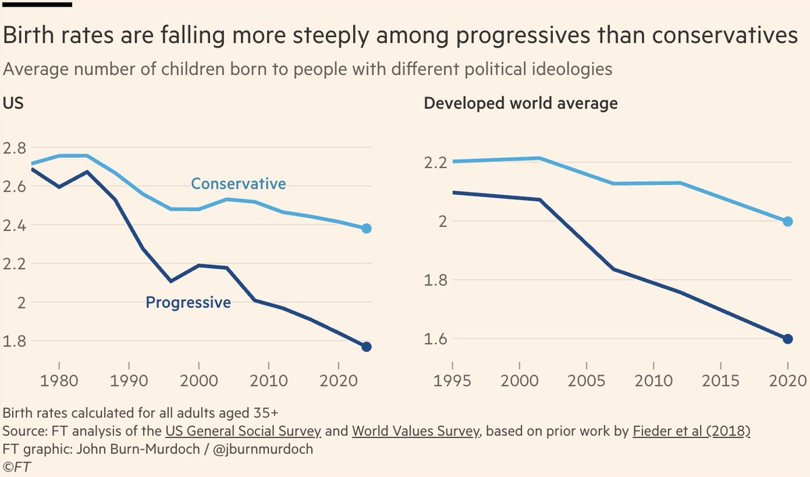

## John Burn-Murdoch
"progressives have a birth rate problem": https://x.com/jburnmurdoch/status/1961388402449744241

But is this a "correlation is not causation" situation? What if political affiliation here is just a proxy for residence in a high-cost area, since progressives tend to live in urban areas and coastal states? The "problem" then would be not with individual progressives but rather with the communities where they live, which make family life difficult and unaffordable.
If you control for region and/or cost of living, does the relationship still hold? Would it be possible to answer this question using microdata? GSS microdata with geographic information is only available through an application process because it's considered "sensitive". https://gss.norc.org/get-the-data.html It does seem like "region" is available in the public data.

> REGION (and its age 16 corresponding variable REG16) now only reflects the four census regions, and not the nine census divisions, being more accurate to its variable name. This change is due to updates in the disclosure review process (see Disclosure Review and Limitation). Moving forward, a new variable DIVISION will be available via the sensitive data process to look at the nine census divisions.

This implies that we may be able to find data at the census division level in a recent (though not latest) release? I don't need the most current data or ongoing monitoring to answer this question, since JBM's chart shows a trend that has been in place for several decades (since 1980).

Can query the data here, which does include census divisions as of 12/8/2025:
(note reference to release version 1)
https://sda.berkeley.edu/sdaweb/analysis/?dataset=gss24rel1

Assumed filters to reproduce JBM's chart:
* All adults age 35+?
* There's some amount of pooling across survey years being applied; I don't have the exact number, but pooling 7 survey instances (centered) results in lines that are broadly consistent.

We can use the `gssr` R package to download the full GSS dataset; by pinning a particular version, we can retrieve data that contains US Census divisions (version 0.7.0).
Commit SHA is `ed90704`, full line is `remotes::install_github("kjhealy/gssr@ed90704")`

## Related sources
JBM cites this blog post in his FT article: https://ifstudies.org/blog/the-conservative-fertility-advantage

The Institute for Family Studies blog post references this X post that plots a correlation between state-level political affiliation and fertility rate, from 2018: https://x.com/fuxianyi/status/1325550119677173760?s=20

